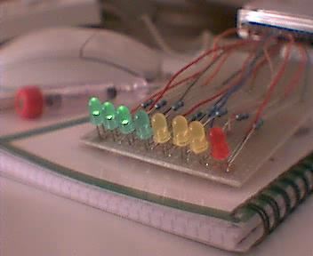

# libparportled

This library is intended to control a LED device plugged on parallel port. A
such device is composed of a number of LED (default is 8, maybe more is
possible, I don't know) plugged on parallel port.

# Usage

* MAXLED is defined as the number of LED available. (--with-maxled= in
  configure option)

* BASEPORT is the IO address of parallel port (--with-port= in configure
  option)

# API

int led_setperm();
Initialise the parallel port, MUST be root !
Return -1 on error.

void led_on_all();
Turn all LED on.

void led_off_all();
Turn all LED off.

int led_on(int led);
Turn LED number "led" on.

int led_off(int led);
Turn LED number "led" off.

int led_set_on(int *state);
State must be a int vector. If value is > 0, LED will be turned on.

int led_set_off(int *state);
Do the inverse of led_set().

int led_blink_on(int led, int us_time);
Start blinking LED number "led". us_time is the time in microsecond of
the state changement.
This function starts a new thread.
Please note that all LED are blinking with in a same interval, the first
us_time is used.
If you do:
led_blink_on(1, 10000);
led_blink_on(2, 2000);
10000 will be used for ALL blinking LED.

int led_blink_off(int led);
Stop blinking LED number led.
If no more led are blinking, thread exits.
